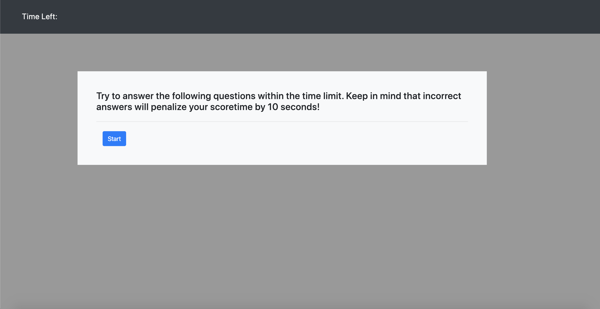
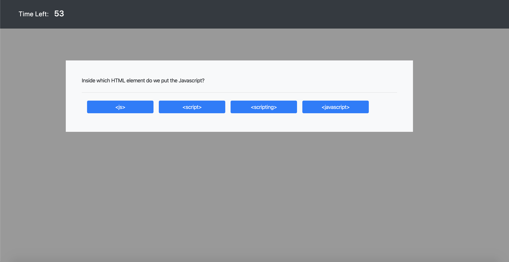

# Vanderbilt Coding Bootcamp homework assignment #4

# Website link

(https://bg9892.github.io/bootcamp-h4/)

## Notes

- JavaScript code quiz.
- Choose the answer to five JavaScript questions with in 60 seconds.
- If you get an answer wrong the time will be subtracted by 10 seconds.
- If time runs out the quiz is over.
- At the end type in your initials to log your score.
- The last score is stored in browser local storage.
- Website styling is made with bootstrap.
- 95% of website html and css is dynamically updated by JavaScript.

# Screenshots

